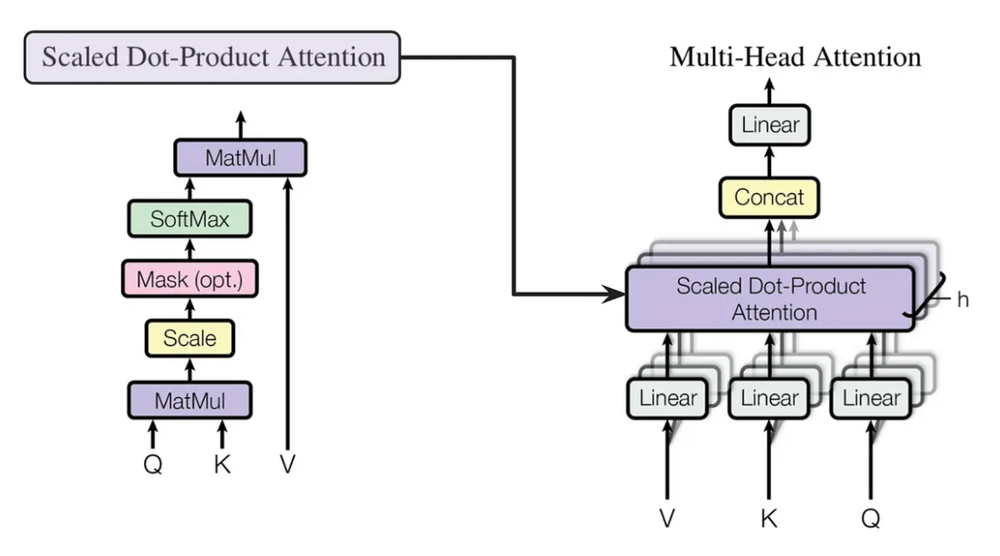

# Multi-Head Self-Attention implementation

## Task

Implement the Multi-Head Self-Attention mechanism of the Transformer architecture in Python.

### Assessment

This task is worth 10 points.

### Dates

* Release data: May 3, 2024
* Due date: May 17, 2024

### Overview

In this assignment, you will implement the Multi-Head Self-Attention mechanism, 
a core component of Transformer models, which have revolutionized the field of natural language processing.
Your task is to develop a modular Python code that breaks down the Multi-Head Self-Attention mechanism
into distinct, reusable functions.
This implementation will help you understand the underlying operations of the attention mechanism.

## Implementation details:

> You can deviate from the process described below, but the final implementation should have the same functionality.

Recommended functions to implement:

1. `create_qkv()`:
   * This function calculates the query, key, and value matrices from the input data using respective weight matrices, 
     setting the foundation for attention calculations.
2. `scaled_dot_product_attention()`:
   * This function performs the attention mechanism by computing scaled dot-product scores between queries and keys,
     applying softmax to these scores, and then using them to obtain a weighted sum of the values.
3. `multi_head_self_attention()`:
   * This function manages the complete multi-head attention process.
     It splits the input into multiple heads, processes each through the attention mechanism independently,
     and then concatenates the results from all heads to produce the final output.

### Architecture as a hint




### Code skeleton

```python
"""
Script implementing the Multi-Head Self-Attention mechanism of the Transformer.
"""

import numpy as np


def create_qkv(
    inputs: np.ndarray,
    weights_q: np.ndarray,
    weights_k: np.ndarray,
    weights_v: np.ndarray
) -> tuple:
    """
    Compute queries, keys, and values from the input tensor.
    """
    
    # implementation
    
    return Q, K, V


def scaled_dot_product_attention(
    Q: np.ndarray,
    K: np.ndarray,
    V: np.ndarray,
    scale: float
) -> np.ndarray:
    """
    Compute the scaled dot product attention.
    """

    # implementation

    return output


def multi_head_attention(
    inputs: np.ndarray,
    weights_q: np.ndarray,
    weights_k: np.ndarray,
    weights_v: np.ndarray,
    num_heads: int
) -> np.ndarray:
    """
    Compute multi-head self-attention.
    """
    
    # implementation
    
    return output


def main():
    """
    Main function, orchestrating the process.
    """

    # input data
    inputs = np.random.rand(1, 5, 32)

    # parameters
    hidden_dim = 32
    num_heads = 4

    # randomly initialize weights for Q, K, V
    weights_q = np.random.rand(hidden_dim, hidden_dim)
    weights_k = np.random.rand(hidden_dim, hidden_dim)
    weights_v = np.random.rand(hidden_dim, hidden_dim)

    # calculate multi_head_attention's output
    attention_output = multi_head_attention(inputs, weights_q, weights_k, weights_v, num_heads)


if __name__ == "__main__":
  
    main()

```